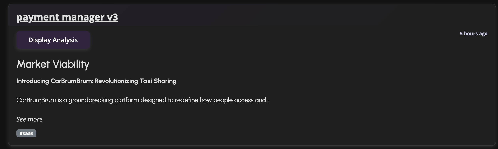

# AI analysis

Check potential of your Idea today with Cresh in a minute.
### [Cresh.me](https://cresh.me/?utm_source=github&utm_medium=instruction)

## Generate analysis

**Only ideas with a minimum of 1000 characters will be analysed.**
We created a dedicated wizard for it, which contains 6 steps where you can fill the information about your idea. Each category must contain at least **250** characters.
You can also don't use our wizard but then your idea description must contain **>1000 characters** to proceed with validation.   
Example of first step in wizzard

Evaluation depends on the obtained values of the analysis metrics. You can find the exact list of obtained metrics below.

## Detail view

However, we see the greatest value in the detailed view, which includes explanations of the ratings given and suggestions related to them. Everything is presented in charts that allow intuitive evaluation of the idea.

 

Here's also the view of one of the metrics with score explanation:

 
You can find it for every metric.

To better understand the intricate metrics, we decided to divide them into 5 categories:

| Metric shortcut  | Metric full name  |
|---|---|
| TVG  | Technical Viability Group  |
| MVG  | Market Viability Group  |
| PVG  | Product Viability Group  |
| MSG  | Market Strategy Group  |
| RFVG  | Risk and Financial Viability Group  |

You can find all metrics in below Table:

| Cue Name               | Group |
|------------------------|-------|
| Technical feasibility  |   TVG    |
| Functional performance |   TVG    |
| Research and development |  TVG   |
| Technology significance |   TVG    |
| Technology of production |  TVG   |
| Tooling cost            |   TVG    |
| Need                   |   MVG    |
| Potential market       |   MVG    |
| Trend of demand        |   MVG    |
| Duration of demand     |   MVG    |
| Demand predictability  |   MVG    |
| Product line potential |  PVG     |
| Societal benefits      |  PVG     |
| Compatibility          |   PVG    |
| Learning               |   PVG    |
| Visibility             |  PVG     |
| Appearance             |  PVG     |
| Function               |  PVG     |
| Durability             |  PVG     |
| Price                  |  PVG     |
| Marketing research     |  MSG     |
| Promotion cost         |  MSG     |
| Distribution           |  MSG     |
| Legality               |  MSG     |
| Existing competition   |  MSG     |
| New competition        |  MSG     |
| Development risk       |  RFVG     |
| Dependence             |  RFVG     |
| Protection             |  RFVG     |
| Size of investment     |  RFVG     |
| Cost of production      |  RFVG     |
| Potential sales        |  RFVG     |
| Payback period         |  RFVG     |
| Profitability          |  RFVG     |
