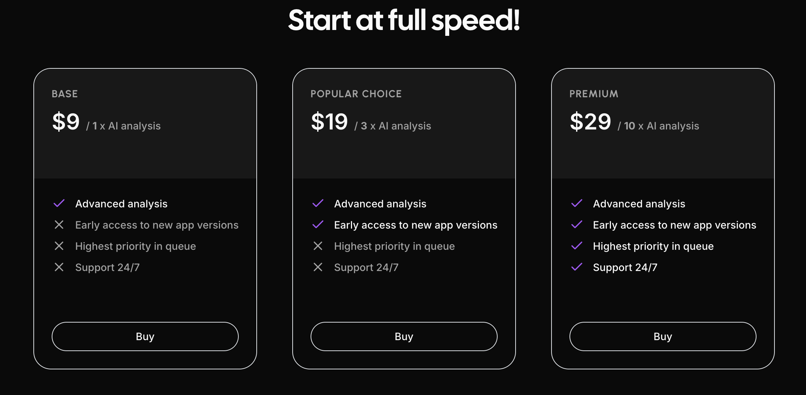

# User Manual

### Authorization
Cresh allows only logged in user to access the main dashboard.

To log into the system, press the login icon in the upper right corner.
 

A login window will appear, requiring an email and password. If you don't have an account, you can press Sign Up, while if you forget your password, you can press "Reset password."

Naturally, there is also a logout button. You can find it in the upper right corner, after pressing on the user profile.

### Dashboard

Dashboard view is the main view of the application. On it, you can find all your ideas. On right side you can see them sorted by latest. 

#### Short Post View

The displayed ideas include basic information and a brief description. If you want to see a detailed view that includes additional information, such as AI analysis press the title of the idea, or if it is displayed "Display Analysis".

### Detail Post View

The detailed view has all the functionality of the Short Post View. It does, however, include [AI analysis](#ai-analysis) by friendly artificial intelligence and allows you to review it.

### AI Analysis

[Read more about AI Analysis](https://github.com/Cresh-Group/cresh-manual/blob/main/ai_analysis.md)

### Pricing
To have access to trigger the idea evaluation you need to have at least 1 Cresh Coin. There are 3 options to get Cresh Coins:
* 9$ - you will get 1 Cresh Coin
* 19$ - you will get 3 Cresh Coins
* 29$ - you will get 29 Cresh Coins

